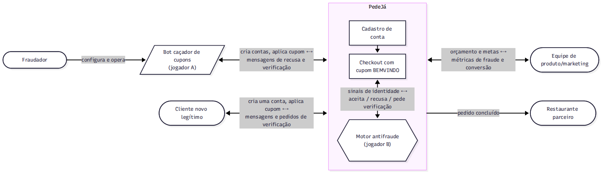
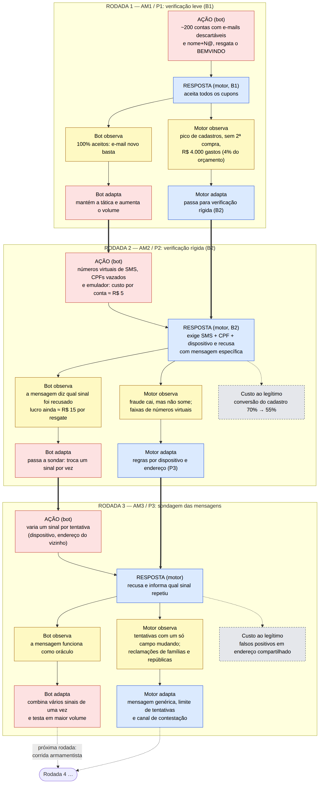
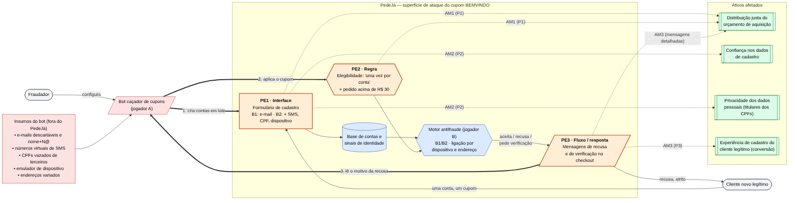

# Trabalho 1 — Análise de um Sistema Adversarial

**Sistema analisado:** aplicativo de delivery de comida (hipotético: _PedeJá_) — **Interação:** resgate do cupom de
desconto de primeira compra (`BEMVINDO`)

**Grupo 9**

| Integrante                               | GitHub             |
|------------------------------------------|--------------------|
| Ariessa Velasques Oliveira               | @ariessa-velasques |
| Maria Eduarda Sanchez Chessio            | @mariasanchez0     |
| Mirieli Rodrigues dos Santos de Oliveira | @mirielii          |
| Vitoria Pereira Garcia                   | @vitoriapgarcia7   |
| Guilherme Jaques                         | @Novato320         |
| Eduardo Dutra Ferreira                   | @ed-dferreira      |

**Links:** [Slides (PDF)](_[link do Google Drive]_) · [Vídeo (YouTube)](_[link]_)

> **Pergunta central:** O que torna esse sistema adversarial, como os participantes tomam decisões e como a interação
> evolui ao longo das rodadas?

## Sumário

0. [Ficha do sistema (decisão do grupo)](#0-ficha-do-sistema-decisão-do-grupo)
1. [Descrição do sistema adversarial](#1-descrição-do-sistema-adversarial)
2. [Modelo estratégico estático](#2-modelo-estratégico-estático)
3. [Modelo estratégico dinâmico](#3-modelo-estratégico-dinâmico)
4. [Ameaças e riscos](#4-ameaças-e-riscos)
5. [Redesenho e resiliência](#5-redesenho-e-resiliência)
6. [Arquitetura proposta para o Trabalho 2](#6-arquitetura-proposta-para-o-trabalho-2)
7. [Conclusão: pergunta final](#7-conclusão-pergunta-final)
8. [Fundamentação conceitual](#8-fundamentação-conceitual)
9. [Referências](#9-referências)
10. [Declaração de uso de IA generativa](#10-declaração-de-uso-de-ia-generativa)
11. [Contribuições individuais](#11-contribuições-individuais)

---

## 0. Ficha do sistema (decisão do grupo)

> Preenchida em conjunto na reunião inicial. **Todas as seções usam estes nomes** — não renomeiem atores, ativos ou
> ações sem atualizar esta ficha.

| Item                                       | Decisão                                                                                                                                                                                                                                                                                                                                  |
|--------------------------------------------|------------------------------------------------------------------------------------------------------------------------------------------------------------------------------------------------------------------------------------------------------------------------------------------------------------------------------------------|
| Sistema                                    | **PedeJá**, aplicativo hipotético de delivery de comida que conecta clientes a restaurantes parceiros.                                                                                                                                                                                                                                   |
| Interação específica                       | **Resgate do cupom `BEMVINDO`**: toda conta nova recebe R$ 20 de desconto no primeiro pedido acima de R$ 30. O desconto é custeado pela plataforma.                                                                                                                                                                                      |
| Ator/jogador A (adversário)                | **Bot caçador de cupons**: agente de software (script automatizado, operado por um fraudador) que cria contas e tenta resgatar o `BEMVINDO` repetidas vezes, ajustando sua estratégia conforme as respostas do checkout.                                                                                                                 |
| Ator/jogador B (defensor/sistema)          | **Motor antifraude do PedeJá**: agente de software que avalia cada cadastro e resgate, escolhe o nível de verificação e decide se o cupom é aceito, ajustando suas regras conforme as métricas observadas.                                                                                                                               |
| Outros atores (humanos, não são jogadores) | **Fraudador**: opera e configura o bot. **Equipe de produto/marketing**: define o orçamento do cupom e cobra conversão. **Cliente novo legítimo**: quer usar o cupom uma única vez, com o mínimo de atrito. **Restaurante parceiro**: recebe os pedidos e ganha com o volume, mas não paga o cupom.                                      |
| Ativo ou propriedade preservada            | **Distribuição justa do orçamento de aquisição**: um desconto por pessoa real. Secundários: a experiência de cadastro do cliente legítimo (conversão) e a confiança nos dados de cadastro.                                                                                                                                               |
| Regra/métrica explorável                   | "Um cupom **por conta**", sendo que conta nova = e-mail ainda não cadastrado. A regra pressupõe 1 conta = 1 pessoa.                                                                                                                                                                                                                      |
| Resposta observável                        | O cupom é **aceito** ou **recusado**, com a mensagem exibida no checkout ("cupom válido apenas para primeira compra", "verifique seu telefone"...); a conta pode ser bloqueada; o sistema pode pedir verificações extras.                                                                                                                |
| Decisão central do jogo (A1/A2 × B1/B2)    | **A1** = **conta única**: o bot opera uma só conta, com comportamento igual ao de um cliente legítimo (não ataca); **A2** = criar contas falsas para resgatar o cupom várias vezes (**multicontas**). **B1** = **verificação leve** (só e-mail); **B2** = **verificação rígida** (SMS no telefone + CPF + identificação do dispositivo). |
| Fora do escopo                             | Pagamento e fraude de cartão, entrega e entregadores, avaliações de restaurantes, programa de fidelidade, outros cupons, ataques à infraestrutura (DoS, invasão).                                                                                                                                                                        |

**Vocabulário comum (usar exatamente estes termos em todas as seções):**

| Termo                     | Significado                                                                      |
|---------------------------|----------------------------------------------------------------------------------|
| cupom `BEMVINDO`          | desconto de R$ 20 na primeira compra acima de R$ 30                              |
| conta                     | cadastro no PedeJá (e-mail + senha; na verificação rígida também telefone e CPF) |
| multicontas               | várias contas controladas pela mesma pessoa                                      |
| verificação leve / rígida | ações B1 / B2                                                                    |
| sinais de identidade      | e-mail, telefone, CPF, dispositivo, endereço de entrega, cartão                  |
| resgate                   | aplicação do cupom a um pedido concluído                                         |
| bot / motor antifraude    | os dois agentes de software que jogam o jogo (A e B)                             |

**Âncoras de rastreabilidade (IDs fixos — todas as seções referenciam estes IDs; cada seção detalha, mas não renomeia
nem remove):**

> As ameaças usam o prefixo **AM** para não confundir com as ações **A1/A2** do jogo.

| ID | Pressuposto                                                                      | Como pode falhar                                                                                                                                                                      |
|----|----------------------------------------------------------------------------------|---------------------------------------------------------------------------------------------------------------------------------------------------------------------------------------|
| P1 | Cada conta corresponde a uma pessoa real diferente (e-mail novo = cliente novo). | E-mails descartáveis e variações do mesmo e-mail (`nome+1@...`) permitem criar contas em massa a custo quase zero.                                                                    |
| P2 | Telefone, CPF e dispositivo são caros ou difíceis de obter em quantidade.        | Chips pré-pagos, números virtuais de SMS, CPFs vazados de terceiros e emuladores ou reset do identificador do aparelho reduzem esse custo.                                            |
| P3 | Um mesmo dispositivo ou endereço de entrega indica a mesma pessoa.               | Famílias, repúblicas e colegas de trabalho compartilham aparelho e endereço (**falso positivo** contra o cliente legítimo); o bot varia endereços (vizinho, portaria, ponto próximo). |

| ID  | Ponto de exploração                                                                   | Tipo                        |
|-----|---------------------------------------------------------------------------------------|-----------------------------|
| PE1 | Formulário de cadastro de conta (e verificação de telefone/CPF na verificação rígida) | Interface                   |
| PE2 | Regra de elegibilidade do cupom no checkout ("uma vez por conta")                     | Regra                       |
| PE3 | Mensagens de recusa e de pedido de verificação exibidas no checkout                   | Fluxo / resposta observável |

| ID  | Ameaça (resumo)                                                                                                                 | Ponto    | Pressuposto ou fraqueza                      | Ativo afetado                                                                                 |
|-----|---------------------------------------------------------------------------------------------------------------------------------|----------|----------------------------------------------|-----------------------------------------------------------------------------------------------|
| AM1 | Bot caçador de cupons cria contas em massa com e-mails descartáveis e resgata o `BEMVINDO` em cada uma                          | PE1, PE2 | P1                                           | Orçamento de aquisição (distribuição justa)                                                   |
| AM2 | Bot caçador de cupons passa pela verificação rígida usando números virtuais, CPFs de terceiros e aparelhos emulados             | PE1      | P2                                           | Orçamento de aquisição; confiança nos dados de cadastro                                       |
| AM3 | Bot caçador de cupons testa variações e lê as mensagens de recusa para descobrir qual sinal o denunciou, trocando só esse sinal | PE3      | Fraqueza: mensagens de recusa detalhadas; P3 | Eficácia da defesa; experiência do cliente legítimo (defesa endurece e gera falsos positivos) |

---

## 1. Descrição do sistema adversarial

> Responsável: **Ariessa**

### 1.1 Sistema e interação analisada

O **PedeJá** é um aplicativo hipotético de delivery de comida que conecta clientes a restaurantes parceiros. A
plataforma ganha uma comissão sobre cada pedido e, para atrair novos clientes, oferece o cupom **`BEMVINDO`**:
**R$ 20 de desconto no primeiro pedido acima de R$ 30**, pago com o orçamento de aquisição da própria plataforma (o
restaurante recebe o valor cheio).

O sistema de delivery como um todo não é o objeto da análise. O trabalho se concentra **em uma única interação: o
resgate do cupom `BEMVINDO`**, que segue este fluxo:

1. uma **conta** é criada no PedeJá (na verificação leve, apenas e-mail e senha);
2. no primeiro pedido, o cupom `BEMVINDO` é aplicado no checkout;
3. o **motor antifraude** avalia a conta e os **sinais de identidade** disponíveis (e-mail, telefone, CPF, dispositivo,
   endereço de entrega, cartão);
4. o motor **aceita** o cupom, **recusa** o cupom (com uma mensagem no checkout) ou **pede uma verificação extra** (por
   exemplo, código por SMS);
5. se o pedido for concluído com desconto, ocorre o **resgate**.

A regra de negócio central é **"um cupom por conta"**. Ela foi pensada para "um cupom por pessoa", mas o sistema só
consegue verificar contas. É nessa diferença entre **conta** e **pessoa** que surge o conflito: um **bot caçador de
cupons** automatiza a criação de contas para resgatar o cupom várias vezes, e o motor antifraude tenta distinguir essas
contas das de clientes novos legítimos sem afastá-los.

Valores de referência (hipotéticos, usados em todo o trabalho):

| Parâmetro                         | Valor                         |
|-----------------------------------|-------------------------------|
| Desconto do `BEMVINDO`            | R$ 20 por resgate             |
| Pedido mínimo                     | R$ 30                         |
| Orçamento mensal de aquisição     | R$ 100.000 (≈ 5.000 resgates) |
| Comissão da plataforma por pedido | 20% do valor do pedido        |

### 1.2 Atores, objetivos e ativos

Os **dois jogadores** da interação são **agentes de software**: o **bot caçador de cupons** (jogador A) e o **motor
antifraude** (jogador B). Os demais atores são pessoas ou organizações que configuram os agentes ou sofrem as
consequências das decisões deles, mas não jogam diretamente.

**Ativo principal — distribuição justa do orçamento de aquisição.** O orçamento do `BEMVINDO` existe para trazer
**pessoas novas** para a plataforma; cada resgate feito por uma conta falsa é dinheiro que não gera um cliente real e
reduz o número de cupons disponíveis para clientes legítimos.

**Ativos secundários:**

- **Experiência de cadastro do cliente legítimo (conversão):** cada verificação extra aumenta o atrito, e parte dos
  clientes reais desiste no meio do caminho.
- **Confiança nos dados de cadastro:** as métricas da plataforma (clientes novos, custo de aquisição) e as próprias
  decisões do motor antifraude dependem de os cadastros corresponderem a pessoas reais.
- **Privacidade dos dados pessoais:** o motor coleta telefone, CPF e identificação do dispositivo; e o bot pode usar
  **CPFs de terceiros** obtidos em vazamentos, envolvendo pessoas que nem participam da interação.

Esses ativos **competem entre si**: proteger o orçamento com verificações mais rígidas prejudica a conversão e aumenta a
coleta de dados pessoais. Por isso o motor antifraude não pode simplesmente "verificar tudo ao máximo".

| Ator                                            | Objetivo                                                                                          | Ações ou capacidades                                                                                                                                                                                                                             | Informações observáveis                                                                                                                                                                                             | Restrições ou custos                                                                                                                                                                                                           |
|-------------------------------------------------|---------------------------------------------------------------------------------------------------|--------------------------------------------------------------------------------------------------------------------------------------------------------------------------------------------------------------------------------------------------|---------------------------------------------------------------------------------------------------------------------------------------------------------------------------------------------------------------------|--------------------------------------------------------------------------------------------------------------------------------------------------------------------------------------------------------------------------------|
| **Bot caçador de cupons** (jogador A, software) | Maximizar o número de resgates do `BEMVINDO` com o menor custo por conta                          | Criar contas em lote; gerar e-mails descartáveis ou variações (`nome+1@...`); usar números virtuais de SMS e CPFs de terceiros; trocar o identificador do dispositivo (emulador); variar o endereço de entrega; repetir tentativas com variações | Se o cupom foi aceito ou recusado; o texto das mensagens de recusa e de verificação; quais verificações são pedidas e em que momento; se a conta foi bloqueada; taxa de sucesso por tipo de conta                   | Cada resgate exige um pedido real de pelo menos R$ 30 (o bot paga R$ 10 ou mais); números de SMS e CPFs têm custo e se esgotam; contas bloqueadas são perdidas; tempo de configuração e manutenção do script                   |
| **Motor antifraude** (jogador B, software)      | Garantir **um cupom por pessoa real**, recusando multicontas sem afastar clientes novos legítimos | Escolher o nível de verificação (leve ou rígida); pedir SMS e CPF; identificar o dispositivo; recusar o cupom; bloquear contas; ajustar limites e regras a partir das métricas; escolher o texto da mensagem de recusa                           | Sinais de identidade de cada conta; histórico de cadastros e resgates; volume de contas por dispositivo, endereço e cartão; taxas de aprovação, recusa e desistência no checkout; reclamações de clientes recusados | Custo de cada SMS e consulta de CPF; queda de conversão a cada verificação extra; **falsos positivos** (clientes reais recusados); **falsos negativos** (resgates fraudulentos aceitos); limites da LGPD sobre coleta de dados |
| **Fraudador** (humano, operador do bot)         | Obter comida com desconto ou revender pedidos com desconto                                        | Configurar, pausar e reprogramar o bot; comprar números e CPFs; escolher quantas contas criar                                                                                                                                                    | Relatórios do bot (sucessos, recusas, mensagens)                                                                                                                                                                    | Dinheiro investido em infraestrutura do bot; risco de bloqueio e de responsabilização legal                                                                                                                                    |
| **Cliente novo legítimo** (humano)              | Usar o cupom **uma vez**, com o mínimo de atrito                                                  | Criar uma conta; informar telefone e CPF quando pedido; desistir do cadastro; reclamar no suporte                                                                                                                                                | Mensagens do checkout; pedidos de verificação                                                                                                                                                                       | Tempo e paciência limitados; pode compartilhar dispositivo ou endereço com outras pessoas (família, república)                                                                                                                 |
| **Equipe de produto/marketing** (humano)        | Adquirir muitos clientes novos dentro do orçamento                                                | Definir valor e orçamento do cupom; cobrar do motor antifraude menos atrito ou menos fraude                                                                                                                                                      | Métricas de aquisição, conversão e custo por cliente novo                                                                                                                                                           | Orçamento limitado; metas de crescimento                                                                                                                                                                                       |
| **Restaurante parceiro**                        | Receber mais pedidos                                                                              | Aceitar e preparar pedidos                                                                                                                                                                                                                       | Volume de pedidos                                                                                                                                                                                                   | Não controla o cupom; é pouco afetado diretamente (recebe o valor cheio)                                                                                                                                                       |

### 1.3 Pressupostos e como podem falhar

O motor antifraude só funciona se alguns pressupostos forem verdadeiros. Cada um deles pode falhar **por ação
intencional do bot** (e não apenas por acaso), e é daí que saem as ameaças da seção 4.

| ID | Pressuposto                                                                                                                                                                                              | Como pode falhar                                                                                                                                                                                                                                                                                                                                    |
|----|----------------------------------------------------------------------------------------------------------------------------------------------------------------------------------------------------------|-----------------------------------------------------------------------------------------------------------------------------------------------------------------------------------------------------------------------------------------------------------------------------------------------------------------------------------------------------|
| P1 | **Cada conta corresponde a uma pessoa real diferente.** A regra "um cupom por conta" só equivale a "um cupom por pessoa" se criar uma conta tiver algum custo para quem a cria.                          | Na verificação leve, uma conta nova depende só de um e-mail novo. O bot gera e-mails descartáveis ou variações do mesmo endereço (`nome+1@gmail.com`, `nome+2@gmail.com`) a custo praticamente zero, e cada um vira um "cliente novo" para o sistema.                                                                                               |
| P2 | **Telefone, CPF e dispositivo são caros ou difíceis de obter em quantidade.** A verificação rígida parte do princípio de que uma pessoa tem poucos números de telefone, um único CPF e poucos aparelhos. | Existem números virtuais que recebem SMS por alguns reais, chips pré-pagos baratos, listas de CPFs vazados e emuladores que geram um novo identificador de dispositivo a cada execução. O custo por conta sobe, mas pode continuar menor que os R$ 20 de desconto.                                                                                  |
| P3 | **Um mesmo dispositivo ou endereço de entrega indica a mesma pessoa.** O motor usa esses sinais para ligar várias contas a um único dono.                                                                | Falha nos **dois sentidos**: (a) pessoas diferentes compartilham aparelho e endereço (família, república, colegas de trabalho), e o motor recusa um **cliente legítimo** (falso positivo); (b) o bot varia o endereço (vizinho, portaria, ponto de retirada próximo) e troca o identificador do dispositivo, escapando da ligação (falso negativo). |

### 1.4 Diagrama de contexto



Fonte editável: [`diagramas/contexto.mmd`](diagramas/contexto.mmd)

### 1.5 Por que é adversarial (e não apenas erro ou acidente)

Uma conta duplicada ou um cupom aplicado duas vezes nem sempre indicam um adversário. Três situações parecidas ajudam a
mostrar a diferença:

| Situação                                                                     | Tipo            | Por quê                                                                                                                      |
|------------------------------------------------------------------------------|-----------------|------------------------------------------------------------------------------------------------------------------------------|
| Cliente esquece a senha, cria uma segunda conta e usa o cupom de novo        | **Acidente**    | Não há intenção de explorar a regra nem adaptação: se o cupom for recusado, a pessoa simplesmente paga o valor cheio.        |
| Falha no código aplica o `BEMVINDO` duas vezes no mesmo pedido               | **Erro**        | O problema é do próprio sistema; corrigido o bug, ele não volta a acontecer. Ninguém do outro lado está tentando provocá-lo. |
| Bot cria 200 contas por semana e muda de tática quando começa a ser recusado | **Adversarial** | Há um agente com intenção, objetivo conflitante e capacidade de se adaptar.                                                  |

O resgate do `BEMVINDO` é adversarial porque reúne as características estudadas na disciplina:

1. **Dois agentes que tomam decisões:** o bot decide quantas contas criar e com quais sinais de identidade; o motor
   antifraude decide o nível de verificação e se aceita ou recusa o cupom.
2. **Objetivos conflitantes:** cada resgate fraudulento é um ganho para o bot e uma perda no orçamento da plataforma. O
   conflito é **parcial**, não total: um pedido feito com cupom fraudulento ainda gera comissão para a plataforma e
   venda para o restaurante. Por isso o motor não quer bloquear todo pedido suspeito a qualquer custo, e ainda precisa
   preservar a experiência do cliente legítimo.
3. **Regra explorável:** "um cupom por conta" depende de os pressupostos P1–P3 se manterem; o bot ganha exatamente
   quando consegue quebrá-los.
4. **Resposta observável e adaptação:** toda recusa, mensagem ou pedido de verificação **informa** o bot sobre o que foi
   detectado, e ele pode trocar a tática (e-mails descartáveis → números virtuais → emuladores). Da mesma forma, o motor
   observa as métricas de cadastros e resgates e ajusta as próprias regras. Nenhuma das duas decisões é tomada uma única
   vez: elas **evoluem em rodadas**, cada uma reagindo à anterior (seção 3).

Um erro ou acidente, uma vez corrigido, deixa de acontecer. Já aqui, **cada defesa muda o comportamento do outro lado**,
que é exatamente o que caracteriza um sistema adversarial.

---

## 2. Modelo estratégico estático

> Responsável: **Mirieli**

**Ordem do par:** `(payoff de A, payoff de B)` — escala: 3 = melhor, 0 = pior.

| Jogador A \ Jogador B | B1: _[ação]_ | B2: _[ação]_ |
|-----------------------|-------------:|-------------:|
| **A1: _[ação]_**      |      `( , )` |      `( , )` |
| **A2: _[ação]_**      |      `( , )` |      `( , )` |

### 2.1 O que representa cada ação

### 2.2 Justificativa dos payoffs

_[Justificar cada uma das 4 células, com base nos objetivos e custos da seção 1.]_

### 2.3 Melhores respostas

- Se B joga B1, a melhor resposta de A é ...
- Se B joga B2, a melhor resposta de A é ...
- Se A joga A1, a melhor resposta de B é ...
- Se A joga A2, a melhor resposta de B é ...

### 2.4 Estratégia dominante

### 2.5 Equilíbrio (nenhum jogador melhora mudando sozinho)

### 2.6 O equilíbrio é bom para o sistema e para usuários legítimos?

---

## 3. Modelo estratégico dinâmico

> Responsável: **Vitoria**

A matriz da seção 2 é uma **fotografia**: mostra o que acontece em cada combinação de ações (A1/A2 × B1/B2). Aqui ela
vira um **filme**: as mesmas duas decisões são repetidas em rodadas, e em cada rodada os dois agentes (o **bot caçador
de cupons** e o **motor antifraude**) leem a resposta do outro antes de decidir de novo. Cada rodada corresponde a uma
janela de tempo (por exemplo, uma semana) em que o bot tenta resgatar o cupom `BEMVINDO` e o motor observa as métricas.
As três rodadas seguem a ordem **AM1 → AM2 → AM3** (pressupostos **P1 → P2 → P3**) da Ficha do sistema.

**Valores de referência (hipotéticos, coerentes com a seção 1):** desconto de R$ 20 por resgate; orçamento mensal de R$
100.000 (≈ 5.000 resgates); comissão de 20% sobre o pedido de R$ 30 (R$ 6). Seja **c** o custo do bot para criar uma
conta aceita: o ganho do bot por resgate é
**R$ 20 − c**, e o prejuízo líquido da plataforma por resgate fraudulento é ≈ **R$ 14** (R$ 20 de desconto − R$ 6 de
comissão). Estado inicial: verificação leve (B1) e mensagens de recusa detalhadas.

Ciclo: **ação → resposta → observação → adaptação**

|            Rodada | Ação do participante                                                                                                                                                                                                                            | Resposta do sistema ou defensor                                                                                                                                                                                                                                            | O que se torna observável?                                                                                                                                                                                                                                                                                                                                                                                        | Adaptação para a rodada seguinte                                                                                                                                                                                                                                                                                                                                       |
|------------------:|-------------------------------------------------------------------------------------------------------------------------------------------------------------------------------------------------------------------------------------------------|----------------------------------------------------------------------------------------------------------------------------------------------------------------------------------------------------------------------------------------------------------------------------|-------------------------------------------------------------------------------------------------------------------------------------------------------------------------------------------------------------------------------------------------------------------------------------------------------------------------------------------------------------------------------------------------------------------|------------------------------------------------------------------------------------------------------------------------------------------------------------------------------------------------------------------------------------------------------------------------------------------------------------------------------------------------------------------------|
| 1 <br/>(AM1 / P1) | **Bot (A2, multicontas):** cria ≈ 200 contas em uma semana com e-mails descartáveis e variações `nome+N@...` e resgata o `BEMVINDO` em cada uma. Custo por conta ≈ R$ 0.                                                                        | **Motor em B1 (verificação leve):** só confere se o e-mail é novo; aceita todos os cupons.                                                                                                                                                                                 | **Bot:** 100% de aceitação, então e-mail novo basta e o checkout não olha dispositivo nem telefone. <br/>**Motor:** pico de cadastros vindos de poucos domínios e padrões `nome+N`, contas sem segunda compra, endereços de entrega repetidos; 200 resgates = R$ 4.000 (4% do orçamento mensal).                                                                                                                  | **Bot:** funcionou a custo ≈ 0, então mantém a tática e aumenta o volume. <br/>**Motor:** o pico dispara a mudança para **B2** (SMS + CPF + identificação do dispositivo). Mesmo objetivo (um cupom por pessoa), nova ação.                                                                                                                                            |
| 2 <br/>(AM2 / P2) | **Bot:** repete a tática e é barrado no pedido de telefone. Mantém o objetivo e **muda a ação**: números virtuais de SMS (≈ R$ 3), CPFs vazados (≈ R$ 2) e emulador com novo identificador de dispositivo a cada conta. **c sobe para ≈ R$ 5.** | **Motor em B2 (verificação rígida):** exige SMS, CPF e dispositivo; recusa contas que repetem telefone, CPF ou dispositivo. Para não frustrar clientes legítimos, **a mensagem de recusa é específica** ("este CPF já foi usado", "este dispositivo já resgatou o cupom"). | **Bot:** sabe quais sinais o checkout exige e **qual sinal foi recusado em cada tentativa** (a resposta virou informação); ainda lucra ≈ R$ 15 por resgate (R$ 20 − R$ 5). <br/>**Motor:** resgates fraudulentos caem, mas não a zero; aparecem faixas de números virtuais e o mesmo CPF em vários aparelhos. **Efeito colateral:** a conclusão do cadastro cai de 70% para 55% e o suporte recebe mais chamados. | **Bot:** como ainda compensa, não desiste; passa a **sondar**, trocando um sinal por vez e lendo a mensagem de recusa. <br/>**Motor:** acrescenta regras de ligação por **dispositivo e endereço** (P3) e bloqueia faixas de telefone virtual conhecidas. Mantém as mensagens detalhadas para reduzir reclamações (o que abre a rodada 3).                             |
| 3 <br/>(AM3 / P3) | **Bot:** cada conta nova varia **um único sinal** em relação à anterior (novo dispositivo emulado; depois endereço do vizinho ou da portaria) e lê a recusa até achar a combinação aceita.                                                      | **Motor (regras por dispositivo/endereço):** recusa e informa qual sinal repetiu. As mesmas regras também recusam **famílias e repúblicas** que dividem aparelho ou endereço (**falso positivo**).                                                                         | **Bot:** a mensagem funciona como um **oráculo**: em poucas tentativas descobre que endereço e dispositivo são os sinais decisivos. <br/>**Motor:** sequências de tentativas em que só um campo muda (padrão de sondagem), mais reclamações e recusas concentradas em endereços compartilhados. Parte das contas do bot com endereços variados **ainda passa**.                                                   | **Bot:** troca vários sinais de uma vez e testa em maior volume (mais contas "queimadas" por resgate bem-sucedido, c ≈ R$ 8). <br/>**Motor:** substitui a mensagem detalhada por uma genérica ("não foi possível aplicar o cupom"), limita tentativas por dispositivo e sessão e cria um canal de contestação para falsos positivos (controles detalhados na seção 5). |

### Balanço de custos por rodada (valores hipotéticos)

| Rodada | Custo e ganho do bot                | Custo do motor                                                                                              | Efeito sobre o cliente legítimo                                   | O que fica de herança para a rodada seguinte                                                                  |
|-------:|-------------------------------------|-------------------------------------------------------------------------------------------------------------|-------------------------------------------------------------------|---------------------------------------------------------------------------------------------------------------|
|      1 | c ≈ R$ 0; ganho ≈ R$ 20 por resgate | R$ 4.000 do orçamento em ≈ 200 resgates fraudulentos (prejuízo líquido ≈ R$ 2.800 já descontada a comissão) | Nenhum atrito                                                     | O motor ficou sabendo do padrão de e-mails e endereços; o bot ficou sabendo que B1 só olha o e-mail           |
|      2 | c ≈ R$ 5; ganho ≈ R$ 15 por resgate | SMS e consulta de CPF em **todo** cadastro (inclusive de legítimos); mais suporte                           | Conversão do cadastro 70% → 55%                                   | O motor não volta a B1 sem reabrir a fraude; as mensagens detalhadas já divulgadas criam a brecha da rodada 3 |
|      3 | c ≈ R$ 8; ganho ≈ R$ 12 por resgate | Falsos positivos, reclamações e atendimento; custo de manter regras por dispositivo/endereço                | Famílias e repúblicas recusadas; parte desiste do cupom ou do app | Mensagem genérica sem feedback obriga o bot a inferir pelo resultado binário (aceito/recusado)                |

### Como as rodadas cumprem o que o modelo dinâmico exige

- **A resposta também produz informação.** Rodada 1: a aceitação total ensina ao bot que e-mail novo basta. Rodada 2: a
  mensagem "este CPF já foi usado" revela qual sinal foi recusado. Rodada 3: a mesma mensagem vira um oráculo para a
  sondagem.
- **O bot mantém o objetivo e muda a ação.** O objetivo é sempre maximizar resgates com o menor custo; a ação vai de
  e-mails descartáveis → números virtuais, CPFs e emulador → sondagem de um sinal por vez → combinação de vários sinais.
- **O defensor também observa e se adapta.** O motor sai de B1 para B2 a partir de métricas agregadas (picos de
  cadastro, resgates sem segunda compra) e depois muda regras e mensagens a partir de falsos positivos e de padrões de
  sondagem.
- **Decisões passadas limitam as seguintes.** O motor não volta a B1 sem reabrir a rodada 1; contas, números e CPFs já
  usados ficam marcados; a escolha de mensagens detalhadas na rodada 2 é o que torna a rodada 3 possível.
- **A defesa tem custo para o legítimo.** Na rodada 2 a conversão cai 15 pontos percentuais; na rodada 3 surgem falsos
  positivos em endereços compartilhados.

A rodada 1 equivale à célula **(A2, B1)** da matriz estática e a rodada 2 à célula **(A2, B2)**; a rodada 3 não cabe em
uma célula, porque o bot passa a escolher suas ações **como sondagem**, para descobrir as regras do motor. É essa
diferença que o modelo dinâmico acrescenta.

### 3.1 Diagrama do ciclo adaptativo



Fonte editável: [`diagramas/ciclo-adaptativo.mmd`](diagramas/ciclo-adaptativo.mmd)

### 3.2 Síntese

- **Quem observa quem?** O **bot observa o motor de forma ativa**: cada tentativa é um teste, e a resposta do checkout
  (aceito, recusado, mensagem, verificação pedida, conta bloqueada) chega na hora. O motor observa o bot de forma
  indireta: só enxerga rastros agregados (volume de cadastros, sinais repetidos, taxas de resgate, reclamações), e com
  atraso. Ele não sabe, de antemão, se uma conta é bot ou cliente legítimo.
- **O que cada lado consegue mudar?** O **bot** muda a fonte das contas (e-mail → telefone, CPF e dispositivo →
  endereço), o ritmo, o volume e a forma de testar. O **motor** muda o nível de verificação (B1/B2), as regras de
  ligação por dispositivo e endereço, os limites de tentativas, o texto das mensagens e o canal de contestação. Nenhum
  dos dois muda o que o outro controla: o bot não altera a regra "um cupom por conta" nem o valor do desconto; o motor
  não controla quem cria contas nem o custo de números e CPFs no mercado.
- **O que dispara uma adaptação?** **No bot:** uma recusa ou pedido de verificação novo, ou a queda do lucro por conta
  (R$ 20 − c) abaixo do esperado. **No motor:** pico de cadastros, resgates sem segunda compra, sinais repetidos (CPF,
  dispositivo, endereço) e, no sentido contrário, **queda de conversão e aumento de reclamações**, que o levam a
  afrouxar ou a mudar o texto das mensagens.
- **Qual é o custo da adaptação para cada lado?**

  | | Bot | Motor antifraude |
                  |-|-|-|
  | Custo da adaptação | Mais dinheiro por conta (R$ 0 → R$ 5 → R$ 8); contas e números "queimados"; tempo para reescrever o script | Custo de SMS e consulta de CPF em todo cadastro; engenharia e manutenção das regras; suporte; limites da LGPD sobre coleta de dados |
  | Quem mais paga | O fraudador | **Também o cliente legítimo** (atrito, falso positivo) e a equipe de produto (conversão) |

- **Em que ponto pode surgir uma corrida armamentista?** A partir da **rodada 2 para a 3**: cada lado passa a responder
  ao último movimento do outro com um movimento mais caro (verificação rígida → números virtuais; mensagens detalhadas →
  sondagem; mensagem genérica → testes em maior volume). O custo do bot sobe a cada rodada, mas só enquanto **c <
  R$ 20**: acima disso o resgate deixa de compensar e a corrida acaba. Já o custo do motor é pago por **todos** os cadastros, legítimos e fraudulentos, e cada endurecimento extra só se justifica enquanto a fraude evitada (≈ R$
  14 por resgate) for maior que o atrito causado. Se o mercado de números e CPFs ficar mais barato para o bot com a
  escala, o bot tende a vencer a corrida de custos; por isso a defesa não pode ser só "endurecer mais" (ver seção 5).

---

## 4. Ameaças e riscos

> Responsável: **Maria Eduarda**

### 4.1 Pontos de exploração

| ID  | Ponto de exploração             | Tipo (interface, regra, componente, fluxo) | Descrição    |
|-----|---------------------------------|--------------------------------------------|--------------|
| PE1 | Formulário de cadastro          | Interface                                  | _[detalhar]_ |
| PE2 | Regra de elegibilidade do cupom | Regra                                      |              |
| PE3 | Mensagens de recusa/verificação | Fluxo                                      |              |

### 4.2 Diagrama de superfície de ataque



Fonte editável: [`diagramas/superficie-de-ataque.mmd`](diagramas/superficie-de-ataque.mmd)

### 4.3 Cenários de ameaça

> Um **[ator]** pode realizar **[ação]** por meio de **[ponto de exploração]**, aproveitando
> **[fraqueza ou pressuposto]**, causando **[impacto]** sobre **[ativo ou propriedade]**.

- **AM1:**
- **AM2:**
- **AM3:**

### 4.4 Avaliação de riscos

Probabilidade e impacto: 1 = baixo, 2 = médio, 3 = alto. Risco = probabilidade × impacto.

| ID  | Cenário de ameaça | Ponto de exploração | Pressuposto ou fraqueza   | Ativo afetado | Probabilidade | Impacto | Risco |
|-----|-------------------|---------------------|---------------------------|---------------|--------------:|--------:|------:|
| AM1 |                   | PE1, PE2            | P1                        |               |               |         |       |
| AM2 |                   | PE1                 | P2                        |               |               |         |       |
| AM3 |                   | PE3                 | P3 / mensagens detalhadas |               |               |         |       |

### 4.5 Ameaça prioritária: _[ID]_

1. **Como o sistema poderia responder:**
2. **Que informação essa resposta revelaria:**
3. **Como o adversário se adaptaria na rodada seguinte:**
4. **Efeitos colaterais sobre usuários legítimos:**
5. **Risco que continua existindo após a resposta:**
6. **O que o sistema precisa continuar preservando:**

---

## 5. Redesenho e resiliência

> Responsável: **Eduardo** (a partir das ameaças AM1–AM3 da Ficha e das adaptações da rodada 3 da seção 3 — não depende
> das notas de risco da seção 4)

O redesenho do **PedeJá** busca preservar a **distribuição justa do orçamento de aquisição: um desconto por pessoa
real**, equilibrando a redução do abuso, os custos da defesa e a experiência do **cliente novo legítimo**. Os controles
abaixo respondem às ameaças **AM1–AM3**, aos pressupostos **P1–P3** e às adaptações da seção 3. O benefício permanece em
**R$ 20 na primeira compra acima de R$ 30**. Os controles são propostas para o sistema hipotético, cuja eficácia deverá
ser avaliada.

### 5.1 Controles associados às ameaças

| Ameaça                                     | Controle contextualizado                                                                                                                                                                                                                      | Mudança de incentivo                                                                                             | Sinal observável / métrica                                                                            | Próxima adaptação esperada do adversário                                                         | Risco residual                                                                                                  |
|--------------------------------------------|-----------------------------------------------------------------------------------------------------------------------------------------------------------------------------------------------------------------------------------------------|------------------------------------------------------------------------------------------------------------------|-------------------------------------------------------------------------------------------------------|--------------------------------------------------------------------------------------------------|-----------------------------------------------------------------------------------------------------------------|
| **AM1 — criação de contas em massa**       | No **PE1** e no **PE2**, combinar limites por conta, sessão e conjuntos de sinais com o histórico de cadastros e resgates. Exigir **B2** diante de combinações suspeitas e intensificar a análise quando houver consumo anormal do orçamento. | Reduzir resgates por período e aumentar o esforço de distribuir contas, dificultando a exploração de **P1**.     | Concentração e ritmo de cadastros e resgates; descontos concedidos; acionamento de limites.           | Distribuir tentativas no tempo e entre sinais distintos; recorrer a **AM2**.                     | Ataques distribuídos podem passar; limites podem atrasar clientes legítimos.                                    |
| **AM2 — contorno da verificação rígida**   | No **PE1**, verificar telefone, CPF e dispositivo; no **PE2**, avaliar relações entre contas e histórico de resgates, inclusive após aprovação em **B2**. Combinações suspeitas exigem análise adicional.                                     | Dificultar reutilização de recursos e exigir a substituição de vários sinais, elevando o custo por conta aceita. | Reutilização e combinações de sinais; resgates associados; aprovação, recusa e abandono após B2.      | Usar recursos distintos por conta e reduzir ligações observáveis.                                | Dados de terceiros e contas sem vínculos reconhecidos podem passar; relações legítimas podem parecer suspeitas. |
| **AM3 — sondagem das mensagens de recusa** | No **PE3**, usar mensagens genéricas com contestação e registrar os motivos internamente. Combinar limites com intervalos progressivos entre tentativas suspeitas, observando alterações de um ou vários sinais.                              | Reduzir informação por tentativa e a velocidade dos testes, aumentando tempo e recursos necessários.             | Sequências de tentativas; intervalos impostos; alteração de sinais; contestações e decisões revistas. | Alternar sessões e dispositivos, espaçar testes e inferir regras pelo resultado aceito/recusado. | O resultado continua informativo; testes distribuídos podem contornar limites e intervalos.                     |

### 5.2 Proteção do cliente legítimo

Propõe-se manter **B1 — verificação leve** quando não houver indícios suficientes de abuso e exigir **B2 — verificação
rígida** diante de combinações suspeitas. A decisão sobre o cupom deve considerar conjuntamente as verificações e o
histórico: a aprovação em B2 não encerra a análise de elegibilidade.

Essa escolha procura reduzir exigências desnecessárias. Na rodada 2, a conclusão do cadastro cai de **70% para 55%**,
uma redução de **15 pontos percentuais** no cenário hipotético, não uma previsão dos controles propostos.

Conforme **P3**, compartilhar endereço ou dispositivo não comprova fraude, assim como apresentar sinais diferentes não
comprova pessoas distintas. A ausência de segunda compra também não demonstra abuso isoladamente. Quando a suspeita
decorrer de sinais compartilhados e a evidência for insuficiente, deve-se priorizar verificação adicional ou revisão
antes da recusa definitiva.

O checkout deve informar a recusa sem revelar a regra específica, enquanto o registro interno preserva os motivos para
análise. A contestação permite revisar possíveis falsos positivos, mas gera custo de atendimento e não implica aprovação
automática.

Para conter o dano durante novas ondas de abuso, propõe-se acompanhar o valor e a velocidade dos resgates. Um limiar de
alerta deve acionar verificação ou revisão adicional das combinações suspeitas, sem suspender automaticamente todos os
cupons. Esse mecanismo pode retardar o consumo indevido, mas não garante um teto de perdas, pois parte do abuso pode
permanecer sem identificação.

### 5.3 Efeitos sobre os incentivos e os payoffs

Na simplificação da seção 3, o benefício líquido do desconto para o bot é:

$$
G_{\text{bot}} = \text{R\$}\,20 - c
$$

**c** representa o custo médio para obter uma conta aceita e concluir um resgate, incluindo os recursos empregados nas
tentativas frustradas necessárias para esse resultado. Esses custos devem ser contabilizados uma única vez. Com custos
aproximados de R\$ 0, R\$ 5 e R\$ 8, o benefício líquido do desconto permanece em R\$ 20, R\$ 15 e R\$ 12,
respectivamente.
Portanto, elevar o custo não elimina necessariamente o incentivo. O benefício é zero em c = R\$ 20 e negativo acima
disso, dentro dessa simplificação.
Os controles procuram alterar os payoffs da seção 2 da seguinte forma:

- **A1/B1:** preservar o baixo atrito da conta única.
- **A1/B2:** reduzir verificações desnecessárias e permitir revisão de recusas indevidas.
- **A2/B1:** reduzir a velocidade dos resgates repetidos por limites, intervalos e análise de histórico.
- **A2/B2:** elevar o custo de substituir sinais e reduzir resgates indevidos pela análise entre contas, considerando o
  custo da defesa.

Além de elevar **c**, limites e intervalos procuram reduzir a quantidade de resgates obtidos por período. Os custos das
tentativas frustradas devem ser considerados sem dupla contagem caso já estejam incluídos em **c**. Esses efeitos
indicam mudanças pretendidas, sem estabelecer novos valores de payoff, estratégia dominante ou equilíbrio. Para o motor,
o benefício depende de a redução do abuso compensar verificações, manutenção, atendimento e perda de conversão. A
diferença aproximada de R\$ 14 entre desconto e comissão, para pedidos próximos e superiores a R\$ 30, não representa
economia garantida por recusa.

### 5.4 Avaliação e resiliência

A avaliação deve acompanhar:

- **Orçamento:** quantidade, valor e velocidade dos resgates; acionamento dos alertas.
- **Indícios de abuso:** relações entre contas, concentração de sinais, tentativas sucessivas e acionamento de limites e
  intervalos.
- **Experiência do cliente:** conclusão de cadastros e pedidos, abandono após B2, tempo de revisão e decisões
  revertidas.
- **Custo da defesa:** verificações, atendimento e manutenção das regras.

Recusas não equivalem a fraudes detectadas, nem resgates aceitos comprovam legitimidade. Contestações ajudam a
identificar possíveis falsos positivos, mas não revelam todos os erros. Limites, janelas de tempo e metas deverão ser
avaliados na simulação do Trabalho 2.

**Nenhuma defesa é definitiva:** o bot pode distribuir tentativas, substituir sinais e aprender com as respostas do
checkout. A resiliência exige observar resultados, ajustar controles, revisar decisões e acompanhar novas adaptações,
considerando a privacidade e a finalidade dos dados utilizados.

Permanecem riscos de multicontas aceitas, clientes legítimos recusados, uso de dados de terceiros e aprendizagem do bot.
O objetivo é reduzir a vantagem do abuso sem comprometer a distribuição justa do cupom e a experiência do cliente
legítimo.

---

## 6. Arquitetura proposta para o Trabalho 2

> Responsável: **Eduardo**

Esta seção complementa a seção 5 e serve de base para o Trabalho 2. Usa os nomes da Ficha do sistema (A1/A2, B1/B2,
P1–P3, AM1–AM3, PE1–PE3).

### 6.1 Escopo e tecnologia

No Trabalho 2 será implementado um **simulador simplificado do resgate do cupom `BEMVINDO` no PedeJá**, em que os dois
agentes jogam rodadas. Cada rodada é uma janela de tempo simulada (por exemplo, uma semana). Nela, o **bot caçador de
cupons** escolhe **A1** (conta única, com comportamento de cliente legítimo) ou **A2** (multicontas) e tenta resgatar o
cupom; o **motor antifraude** escolhe **B1** (verificação leve) ou **B2** (verificação rígida) e decide aceitar, recusar
ou pedir verificação extra. Cada lado se adapta ao que consegue observar, como na seção 3.

**Demonstração:** três rodadas (número ampliável), em dois modos: **guiado**, que reproduz a sequência AM1 → AM2 → AM3
da seção 3 como roteiro didático, e **adaptativo**, em que os agentes só mudam de comportamento quando suas observações
acionam as regras configuradas, sem sequência garantida.

**O simulador terá:**

- clientes, contas e pedidos **sintéticos** (identificadores fictícios, sem dados reais), incluindo clientes legítimos
  que compartilham endereço ou dispositivo (P3);
- a regra do cupom: R\$ 20 de desconto no primeiro pedido acima de R\$ 30, debitado de um orçamento limitado somente
  quando o pedido é concluído;
- três políticas de defesa para comparação: **B1**, **B2** e o **redesenho da seção 5**, com seus controles: B2 por
  indícios, limites por conta, sessão e sinais correlacionados, intervalos progressivos, mensagens genéricas, alerta de
  orçamento e contestação;
- as métricas da seção 5.4 (orçamento, indícios de abuso, experiência do cliente e custo da defesa), mais falsos
  positivos e falsos negativos, calculados com a identidade sintética conhecida só pelo avaliador.

Ficam fora do escopo os mesmos itens da Ficha (pagamento, entrega, outros cupons, ataques à infraestrutura). SMS, CPF e
dispositivo são dados e verificações simulados.

**Tecnologia:** **Python com Streamlit**, executado localmente em um único processo. Os agentes são funções ou classes
baseadas em regras, sem modelos de IA; Pandas organiza tabelas e indicadores, e sementes aleatórias registradas permitem
repetir os experimentos. A escolha se justifica por permitir interface, execução e gráficos com pouco código e sem
serviços externos, mantendo o foco na lógica da interação.

**Separação de informação:** o bot só vê as respostas públicas das próprias tentativas; o motor vê sinais, tentativas e
resultados, mas não recebe o rótulo "fraudador" nem a identidade sintética; só o avaliador sabe quem controla cada
conta.

### 6.2 Componentes

São divisões lógicas do mesmo programa, não serviços separados.

| Componente                    | Responsabilidade                                                                                                | Entradas                                            | Saídas                                                               |
|-------------------------------|-----------------------------------------------------------------------------------------------------------------|-----------------------------------------------------|----------------------------------------------------------------------|
| Interface web                 | Configurar o experimento, executar as rodadas e mostrar resultados.                                             | Parâmetros e comandos do usuário.                   | Painéis, tabelas e arquivos CSV.                                     |
| Gerador de cenários           | Criar clientes, contas, pedidos e sinais de identidade sintéticos, incluindo compartilhamento legítimo.         | Sementes e quantidades.                             | Dados sintéticos e agenda inicial de ações.                          |
| Controlador de rodadas        | Ordenar os eventos, avançar o tempo simulado e manter o estado entre rodadas.                                   | Agenda, configuração e estado atual.                | Chamadas aos agentes e fechamento de cada rodada.                    |
| Bot caçador de cupons         | Executar A1 ou A2 e adaptar recursos, ritmo e sinais conforme as respostas.                                     | Estratégia atual e respostas públicas do checkout.  | Cadastros, tentativas de resgate e mudanças de estratégia.           |
| Cadastro e checkout do PedeJá | Representar PE1 e PE2: aplicar as regras do cupom e concluir pedidos.                                           | Dados da conta, pedido e decisão do motor.          | Resposta pública e resgate.                                          |
| Motor antifraude              | Escolher B1/B2, analisar sinais e histórico, aplicar limites, intervalos e mensagens, e adaptar a política.     | Eventos operacionais observáveis e regras vigentes. | Aprovação, recusa, verificação extra ou espera; motivo interno.      |
| Revisão de contestações       | Reavaliar recusas contestadas com evidência simulada adicional.                                                 | Contestação, histórico e evidência.                 | Decisão mantida, revertida ou inconclusiva; custo e atraso.          |
| Registro de eventos           | Guardar ações, decisões, custos e mudanças em ordem temporal, com resultado público separado do motivo interno. | Eventos dos demais componentes.                     | Histórico público e histórico interno.                               |
| Avaliador                     | Comparar as decisões com a identidade sintética e calcular as métricas.                                         | Registro de eventos e identidade fictícia.          | Falsos positivos e negativos, orçamento, abandono e custo da defesa. |

### 6.3 Eventos registrados (observabilidade)

Todo evento grava a rodada, o instante simulado, as entidades envolvidas e a versão da política. Nas decisões sobre o
cupom, o **resultado público** (o que o bot vê) fica separado do **motivo interno**. Os eventos abaixo permitem ao motor
observar e se adaptar, e alimentam as métricas da seção 5.

| Evento                                             | Dados principais                                                                           | Métrica da seção 5                                    | Adaptação do motor que dispara                                                                   |
|----------------------------------------------------|--------------------------------------------------------------------------------------------|-------------------------------------------------------|--------------------------------------------------------------------------------------------------|
| `cadastro_iniciado` / `_concluido` / `_abandonado` | Conta e sinais apresentados.                                                               | Conclusão de cadastros; concentração de sinais (AM1). | Pico de cadastros com sinais repetidos: exigir B2 nas combinações suspeitas.                     |
| `relacao_detectada`                                | Contas ligadas por sinal repetido (telefone, CPF, dispositivo ou endereço) e quais sinais. | Relações entre contas (AM2).                          | Combinação suspeita: exigir B2 ou encaminhar à revisão. Compartilhamento isolado não basta (P3). |
| `verificacao_solicitada` / `_concluida`            | B1/B2, tipo, resultado e custo.                                                            | Abandono após B2; custo da defesa.                    | Abandono alto após B2: reduzir exigências para quem não tem indícios.                            |
| `pedido_iniciado` / `_concluido` / `_abandonado`   | Pedido, valor e uso do cupom.                                                              | Conclusão de pedidos.                                 | Queda de conversão: reavaliar o rigor das regras.                                                |
| `cupom_decidido`                                   | Tentativa, resultado público e motivo interno.                                             | Tentativas sucessivas (AM3).                          | Sequência em que só um sinal muda: mensagens genéricas e intervalos progressivos.                |
| `limite_acionado` / `intervalo_imposto`            | Escopo, janela e próxima tentativa permitida.                                              | Acionamento de limites e intervalos.                  | Muitos clientes legítimos atrasados: revisar limiares.                                           |
| `resgate_concluido`                                | Pedido, desconto e saldo restante.                                                         | Quantidade, valor e velocidade dos resgates.          | Alimenta o alerta de orçamento.                                                                  |
| `alerta_orcamento`                                 | Valor, janela e condição acionada.                                                         | Alertas de consumo.                                   | Intensificar a análise das combinações suspeitas, sem recusa coletiva.                           |
| `contestacao_aberta` / `_resolvida`                | Decisão original, resultado, tempo e custo.                                                | Tempo de revisão; decisões revertidas.                | Aumento de reversões: revisar as regras de compartilhamento.                                     |
| `politica_alterada`                                | Versão anterior e nova, e as métricas que motivaram a mudança.                             | Adaptação do defensor.                                | Registro da mudança.                                                                             |
| `estrategia_bot_alterada`                          | Estratégia anterior e nova, e a resposta que motivou.                                      | Adaptação do adversário.                              | Registro, visível só ao avaliador.                                                               |

O bot reage apenas às respostas públicas: aceitação frequente mantém a tática; um novo pedido de verificação leva a
novos sinais (AM2); mensagem detalhada permite trocar o sinal recusado (AM3); mensagem genérica ou espera levam a testar
outras combinações ou espaçar as tentativas.

O motor recebe só os eventos operacionais do PedeJá. A estratégia do bot, suas despesas e a identidade sintética ficam
fora da entrada dele e servem apenas à avaliação, o que permite conferir se cada adaptação se baseou em informação
realmente disponível naquele momento.

### 6.4 Estrutura do projeto

Organização proposta das pastas e arquivos do simulador. Cada módulo corresponde a um componente de 6.2.

```
pedeja-simulador/
├── app.py                      # Interface web (Streamlit): `streamlit run app.py`
├── requirements.txt            # streamlit, pandas
├── README.md                   # como instalar e executar
├── config/
│   └── cenarios.json           # rodadas, orçamento, limiares, sementes e modo (guiado/adaptativo)
├── simulador/
│   ├── modelos.py              # Conta, Pedido, Tentativa, Decisão, Resgate, Política, Evento
│   ├── cenarios.py             # Gerador de cenários (dados sintéticos e agenda de ações)
│   ├── rodadas.py              # Controlador de rodadas (relógio simulado e estado)
│   ├── checkout.py             # Cadastro e checkout do PedeJá (PE1 e PE2, regras do cupom)
│   ├── eventos.py              # Registro de eventos (histórico público e interno)
│   ├── agentes/
│   │   ├── bot.py              # Bot caçador de cupons (A1/A2 e regras de adaptação)
│   │   ├── motor.py            # Motor antifraude (B1/B2, limites, intervalos, mensagens)
│   │   └── revisao.py          # Revisão de contestações
│   └── avaliacao/
│       └── metricas.py         # Avaliador (falsos positivos/negativos, orçamento, custo)
├── tests/
│   ├── test_regras_cupom.py    # mínimo de R$ 30, primeira compra, um resgate por pedido
│   ├── test_agentes.py         # adaptações do bot e do motor por gatilho
│   └── test_metricas.py        # cálculo das métricas da seção 5
└── saidas/                     # CSV exportados (fora do controle de versão)
```

**Regras de dependência:** `app.py` chama `rodadas.py`, que coordena `checkout.py` e os agentes. O bot e o motor recebem
somente as entradas descritas em 6.2 e nunca importam `avaliacao/`. A ligação entre pessoa sintética e conta é mantida
em uma estrutura separada, acessível apenas ao gerador de cenários e ao avaliador. As entradas dos agentes excluem essa
ligação e os rótulos de legitimidade ou fraude; o motor também não recebe a estratégia nem as despesas do bot. Testes
verificam essa separação de informação. Os parâmetros das regras, limiares, custos e probabilidades ficam em
`config/cenarios.json`; a lógica que os utiliza permanece nos módulos do simulador.

---

## 7. Conclusão: pergunta final

> Responsável: **Guilherme**

> **Depois que o sistema responder, o que o outro lado aprenderá e tentará fazer em seguida?**

_[Responder para o PedeJá: depois da última resposta do motor antifraude (seção 3 / ameaça prioritária da seção 4), o que o bot aprende e qual é a próxima ação provável? E o que o motor antifraude aprende com isso?]_

---

## 8. Fundamentação conceitual

> Responsável: **Guilherme**

As definições abaixo são curtas e cada uma é ligada ao caso do **PedeJá**. Os números entre colchetes remetem a
[`fontes/referencias.md`](fontes/referencias.md).

### 8.1 Teoria dos jogos
 
| Conceito                     | Definição                                                                                                                                                                                      | No PedeJá                                                                                                                                  |
|------------------------------|------------------------------------------------------------------------------------------------------------------------------------------------------------------------------------------------|--------------------------------------------------------------------------------------------------------------------------------------------|
| **Sistema adversarial**      | Sistema em que participantes com objetivos total ou parcialmente conflitantes tomam decisões e adaptam o comportamento ao que observam do outro [4][14].                                       | Bot e motor antifraude disputam o orçamento do `BEMVINDO`: o que um ganha, o outro perde.                                                  |
| **Jogo**                     | Situação em que cada jogador escolhe uma ação e o resultado de cada um depende das escolhas de todos [1][2].                                                                                   | Jogo 2×2: A1/A2 (bot) × B1/B2 (motor).                                                                                                     |
| **Payoff**                   | Valor que representa o quanto um jogador prefere um resultado. Em jogos simples, basta a **ordem de preferência** (por exemplo, 0 a 3) [1].                                                    | Cada célula da matriz traz `(payoff do bot, payoff do motor)`, justificado pelos custos da seção 1.                                         |
| **Melhor resposta**          | Ação que dá o maior payoff a um jogador, dada a ação escolhida pelo outro [1].                                                                                                                 | Dado B1, qual é a melhor ação do bot? E dado B2? (seção 2.3)                                                                               |
| **Estratégia dominante**     | Ação que é melhor resposta **qualquer que seja** a ação do outro jogador [1][2]. Não é obrigatório que exista.                                                                                 | Verificada na seção 2.4.                                                                                                                   |
| **Equilíbrio de Nash**       | Combinação de ações em que nenhum jogador melhora mudando **sozinho** [3][1]. Não significa que o resultado seja bom para o sistema nem para os usuários.                                       | Resultado estável da matriz; avaliamos se é bom para o cliente legítimo (seção 2.6).                                                       |
| **Jogo repetido**            | Mesmo jogo jogado em várias rodadas, em que as escolhas passadas são observadas e podem condicionar as seguintes [1][2][5].                                                                    | As 3 rodadas da seção 3: o motor só passa a B2 depois de observar o pico de cadastros da rodada 1.                                         |
| **Corrida armamentista**     | Escalada em que cada lado responde ao último movimento do outro com um movimento mais caro, em um ciclo de adaptação mútua. O termo vem da biologia evolutiva [6] e é usado em segurança [9][10]. | Verificação rígida → números virtuais → sondagem → mensagem genérica → testes distribuídos. Termina para o bot quando c ≥ R$ 20.            |
 
### 8.2 Segurança e análise de ameaças
 
| Conceito                 | Definição                                                                                                                                                  | No PedeJá                                                                                                  |
|--------------------------|------------------------------------------------------------------------------------------------------------------------------------------------------------|------------------------------------------------------------------------------------------------------------|
| **Ativo**                | Aquilo que tem valor e precisa ser protegido: um recurso ou uma propriedade como confiança, privacidade, disponibilidade ou justiça [8][9].                | Distribuição justa do orçamento de aquisição (um desconto por pessoa real).                                |
| **Superfície de ataque** | Conjunto de pontos (interfaces, regras, fluxos, recursos) pelos quais um adversário pode tentar interagir com o sistema ou extrair algo dele [7].          | PE1 (cadastro), PE2 (regra de elegibilidade), PE3 (mensagens de recusa).                                   |
| **Vulnerabilidade**      | Fraqueza do sistema, de um controle ou de um pressuposto que pode ser explorada [11].                                                                      | A regra "um cupom por conta" pressupõe 1 conta = 1 pessoa (P1).                                            |
| **Ameaça**               | Circunstância ou evento com potencial de causar impacto negativo sobre um ativo, por exemplo, um ator que explora uma vulnerabilidade [11][8].             | AM1, AM2 e AM3: cenários no formato "ator, ação, ponto de exploração, fraqueza, impacto, ativo".           |
| **Ataque**               | Ação concreta de um adversário que tenta explorar a vulnerabilidade [9].                                                                                   | Criar ≈ 200 contas com e-mails descartáveis e resgatar o cupom em cada uma (rodada 1).                     |
| **Caso de abuso**        | Descrição de uma interação em que o sistema é usado de forma legítima na aparência, mas com intenção de causar dano [13][12].                              | Cada cadastro e cada resgate são funcionalidades normais; o abuso está em usá-las em massa.                |
| **Impacto**              | Consequência da ameaça concretizada sobre o ativo [11].                                                                                                    | R$ 4.000 do orçamento (4%) em ≈ 200 resgates fraudulentos na rodada 1.                                     |
| **Risco**                | Função da probabilidade de a ameaça ocorrer e do seu impacto [11]. Neste trabalho: risco = probabilidade × impacto, com escala de 1 a 3.                    | Tabela de risco da seção 4.4.                                                                              |
| **Risco residual**       | Risco que permanece depois de aplicado um controle [11].                                                                                                   | Ex.: com mensagem genérica, o resultado aceito/recusado ainda informa o bot (seção 5.1).                   |
 
---

## 9. Referências

Ver [`fontes/referencias.md`](fontes/referencias.md).

---

## 10. Declaração de uso de IA generativa

> Responsável pelo texto: **Guilherme**. **Cada integrante preenche a própria linha** no seu próprio commit (se não usou
> IA, escreva "não utilizou").

_[Texto introdutório — Guilherme.]_

| Integrante                               | Ferramenta | Tarefa em que foi utilizada | Como o conteúdo foi verificado |
|------------------------------------------|------------|-----------------------------|--------------------------------|
| Ariessa Velasques Oliveira               |            |                             |                                |
| Maria Eduarda Sanchez Chessio            |            |                             |                                |
| Mirieli Rodrigues dos Santos de Oliveira |            |                             |                                |
| Vitoria Pereira Garcia                   |            |                             |                                |
| Guilherme Jaques                         |            |                             |                                |
| Eduardo Dutra Ferreira                   |            |                             |                                |

---

## 11. Contribuições individuais

| Integrante                               | Seções / artefatos                                                 | Fala na apresentação                                   |
|------------------------------------------|--------------------------------------------------------------------|--------------------------------------------------------|
| Ariessa Velasques Oliveira               | Seções 0 e 1; diagrama de contexto; integração; montagem do vídeo  | Sistema, atores e pressupostos                         |
| Maria Eduarda Sanchez Chessio            | Seção 4; diagrama de superfície de ataque; revisão de consistência | Ameaças e riscos                                       |
| Mirieli Rodrigues dos Santos de Oliveira | Seção 2                                                            | Modelo estático                                        |
| Vitoria Pereira Garcia                   | Seção 3; diagrama do ciclo adaptativo                              | Modelo dinâmico                                        |
| Guilherme Jaques                         | Seções 7, 8, 9, 10; template dos slides                            | Fundamentos e conclusão                                |
| Eduardo Dutra Ferreira                   | Seções 5 e 6                                                       | Redesenho e resiliência; arquitetura para o Trabalho 2 |

Histórico completo: ver commits do repositório.
